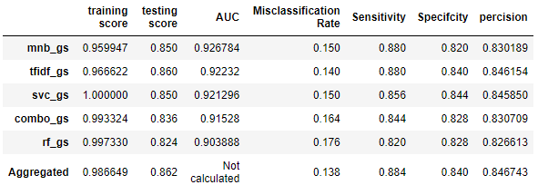

# Reddit Modeling Project
##### Thomaz Moon
___

## Problem Statement
___
Can you create a model that will be able to differentiate posts from the subreddit r/TheOnion compared to posts from r/News? Having an entire subreddit with countless people on r/AteTheOnion, shows that either people are not checking their sources, tend to believe satirical news easily based on their own preconcieved notions/beliefs, or that satirical news are infact not being facetious but perhaps to close to being "real news" and in fact pose a bigger problem at spreading misinformation to people. By creating a model that can successfully tell the difference between the two subreddits, especially a model using a bag of words approach, will show whether or not people just believe what they want to, or if it actually is getting too hard to tell the difference between real and satirical news.

## Executive Summary
___
There used to be a time when people would people would read a news article and have a good laugh about it, knowing it was satirical news. Although it was dressed up to look like real news, the craziness or absurdity of it would immediately let you know that this was just a joke.    

Now a days however, there's an entire subreddit dedicated to people who r/AteTheOnion, meaning they read an onion, or onion type, article and truly believed it. To be fair to them, the world has been getting a bit crazier to the point where the onion couldn't come up with articles anymore because the real news itself sounded like they were coming from the onion.    

Curious about whether now people are just beginning to grow more credulous of all news sources, reliable or not, or if we're still in this "crazy" period, I decided to challenge myself and see if I could predict which subreddit a post title came from. Either r/TheOnion, or r/News. This model will have no sense of right or wrong, understand sarcasm, even understand the title in anyway. However, because it is at such a disadvantage at distinguishing posts compared to humans, if the model can accurately predict which subreddit it belongs to, it means that humans should be able to as well.  

We will be looking at 1,000 posts from both subreddits for a total of 2,000 rows of titles. Our baseline to beat is 50% because there is an even amount of posts from each subreddit. To consider it a win though I would ideally like to get at least an 80% for my model.

## Sources
---
1. **PRAW** - Python Reddit API Wrapper
    1. [Praw Documentation](https://praw.readthedocs.io/en/stable/)
    1. [Youtube Tutorial](https://www.youtube.com/watch?v=8VZhog5C3bU&ab_channel=PythonEngineer)
1. **Reddit**
    1. [Reddit](https://reddit.com)
    1. [r/TheOnion](https://www.reddit.com/r/TheOnion/top/?t=all)
    1. [r/News](https://www.reddit.com/r/news/top/?t=all)
1. **Sklearn** as they ask to be cited on their website if published
    1. [Scikit-learn](https://scikit-learn.org/stable/auto_examples/index.html#classification)

## Data Dictionary for the scrapping
Made using [this website](https://www.tablesgenerator.com/markdown_tables#)

| Column 	| Type 	| Description 	|
|:---:	|:---:	|:---:	|
| title_id 	| object 	| unique Id for the title of the post that can be used to check for comments if needed. 	|
| title 	| object 	| The title of the post submitted onto reddit.  	|
| upvotes 	| int 	| The number of upvotes the post received. 	|
| num_comments 	| int 	| The number of comments the post has. 	|
| author 	| object 	| The username or /u/ of the person who submitted the post onto reddit. 	|
| subreddit 	| object 	| The subreddit that the post was pulled from. 	|

___

## Conclusions   
Overall, all our models had a good ammount of variance in them, and although we didn't find a way to increase the testing accuracy, we did try a number of different ways and saw improvements in other areas such as the training score (although that just meant we had an overfit model). A prime example of one of our overfit models would be model 3, the svc_gs model. It had a perfect accuracy score of 1, however also had the lowest testing accuracy of 0.822 as well as all other metrics in our dataframe.  
___
One model I found intresting was the combo_gs, where I did the Countvect first then pass through the TF-IDF transformer and finally to the mnb model. It scored better than just the Countvectorizer model, however lower than just the TF-IDF model showing that perhaps doing a double transformation wasen't the most benefical. It does show that TF-IDF was a better transformer than just the CountVectorizer as it still scored higher than just the CountVect model.  
One more thing I found intresting is that basically all the model preferred to keep the stop words when doing a gridsearch, which shows that the stop words provided were actually important in determining which subreddit a post belonged to regarding having a BOW decide.  
___
Overall, I would say that we have created a successful model in determining which subreddit a post belongs to. This is based off of just using a BOW approach and not providing context or any form of "emotion or sarcasm". Not only is this saying that humans (who are generally capable of percieving sarcasm and context) should be able to differentitate between fake/satirical news, but also points towards something more profound. **Bias Confirmation** and **Closed Mindset** are probably a big reason as to why people will tend to graviate towards *wanting* to believe these fake news. It's not a matter of it being real or fake news so much as a way off finding anything that will confirm what they already believe to be true in some sense.  

___
## Recommendations  
For future modeling invovling classification and BOW, I would recommend having a much larger pool in order to be able to draw in as many new words to create as features as possible. Especially when it comes to things such as news where they can cover topics ranging from cute animals to space, to medicine discoveries, all of which *might* have their own jargon. The absense of having words that the model was trained on will possibly lead to ignoring certain words that might have been really useful and then instead relying more on those stop words that are basic. Although they can help make predictions, possibly based on the number of stop words used, it isn't something that should be relied on too heavily.  
Although for some other cases I would have possibly recommended using 'bagging', in our situation, because we will just be getting the same words over again it wouldn't really help, and if we were to use the whole data set, we would be leaking in words that the training set should not have accesss to therefor having a bad model.  
___
In terms of recommendations for other people. Based on the model that was focused more accuracy than any other metric, for reason we had already gone over [here](#baseline), it would be a few things actually.
1. Start checking your source instead of believing an article at face value. There are numerous websites now that just come out with fake/satire news.
1. Try to be a bit more open minded about things and not ignore valid points or research just because it goes against some preconceived belief you had. Learning to accept when you're wrong, change, and grow will only help you in the long term.
1. If worse comes to worst, then maybe we should get rid of fake news altogether or have some sort very blatant tag because there are people who will take some of these fake news article seriously and possibly have detrimental issues over things that provide a 2 - 3 second read and provides no real value
